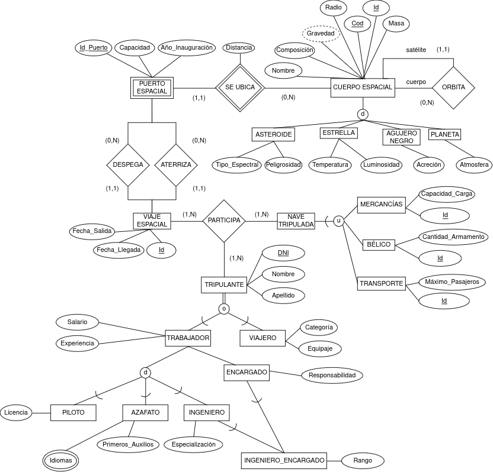
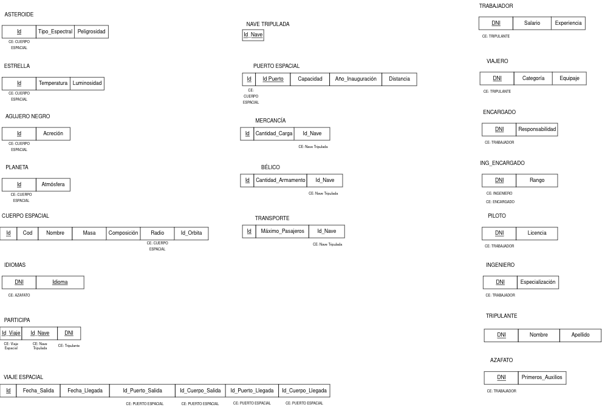

# Análisis de viajes estelares

¡El caos se está apoderando de la galaxia! Millones de vuelos
interestelares se realizan todos los días y está provocando atascos en
los puertos espaciales y pérdidas trillonarias a todos los gobiernos de
la galaxia. Es por esto que se han puesto en común para realizar un
sistema de libre acceso a cualquier individuo u organización que lleve
un registro de los viajes que se realizan, las naves que atracan en los
puertos espaciales y los viajeros que navegan las estrellas.

Se quiere una base de datos que lleve el registro de los **viajes
espaciales** que se realizan entre distintos **puertos estelares**.
Estos puertos se ubican en **cuerpos espaciales**, que son entidades
físicas significativas del espacio. Para nuestra base de datos un cuerpo
espacial podría tratarse de **estrellas**, **planetas**, **agujeros**
**negros** y **asteroides**. Los datos que nos interesan de los
**cuerpos espaciales** serían el nombre, radio, masa, composición y
gravedad que sería un atributo derivado. De las **estrellas** queremos
saber su temperatura y luminosidad para hacer posible la aproximación.
El disco de acreción es una característica interesante de los **agujeros
negros**. De los **planetas** será fundamental saber si son de tipo
rocoso o gaseoso. Y por último sería beneficioso conocer el tipo
espectral del que es cada **asteroide**, por ejemplo, tipo S, C, M, V o
D. Por último, cabe recalcar que todos los **cuerpos espaciales**
orbitan otro **cuerpo espaciales** exceptuando los de orden superior que
pueden no orbitar ningún **cuerpo espaciales**, **agujeros** **negros**
o **estrellas**, por ejemplo.

Los **puertos espaciales** son construcciones diseñadas para el despegue
y aterrizaje de **naves espaciales**. Cada **puerto espacial** se
encuentra en un solo cuerpo espacial. Para identificar a cada puerto
espacial será necesario también el código del **cuerpo espacial** al que
pertenecen. Con el fin de aclarar dudas el código de un **puerto
espacial** que orbita el planeta solar Marte podría ser «MAR-10» estando
formando por el código del **planeta** marte «MAR», y el código del
**puerto** «10». Sin embargo, esto no imposibilitaría que existiera otro
**puerto espacial** en la Tierra también con el código «10». A su vez,
sería interesante guardar la capacidad de naves del puerto, el año de
inauguración de este y la distancia a la que se encuentra del centro del
cuerpo espacial (si es igual que su radio asumimos que está en la
corteza).

Un **viaje espacial** tiene una fecha de salida y fecha de llegada
siempre en hora local del **puerto espacial** correspondiente. A su vez
siempre tiene un **puerto espacial** de despegue y otro **puerto
espacial** de aterrizaje. Dentro de un **viaje espacial** participa una
**nave tripulada** y varios **tripulantes**.

Una **nave tripulada** es simplemente una categoría que indica que una
**nave** está lista para ser utilizada en un viaje. Dentro de **nave
tripulada** podemos encontrarnos con tres tipos de naves. Estas son:

-   **Mercancías**, con distintas capacidades de carga.
-   **Bélicas**, con distintas cantidades de armamentos.
-   **Transporte**, con distinta capacidad máxima de pasajeros.

Los **tripulantes** de un viaje están formados por **trabajadores** y
**viajeros**. Los **trabajadores** son los asalariados de la agencia
encargada del viaje y sus labores son diversas dentro de está. Luego
tenemos los **viajeros** que son los clientes que disfrutan los
servicios de transporte de la nave y que no tienen responsabilidades
laborales dentro de esta. A los **tripulantes** los identificaremos por
su DNI y guardaremos datos como su nombre o contacto. A los
**trabajadores** de la nave convendría saber su salario y su
experiencia. A su vez, es necesario guardar en que categoría viajan los
viajeros, primera clase etc. Y la cantidad de equipaje que llevan.

Dentro de los **trabajadores** podemos diferenciar a tres tipos. Los
**pilotos**, encargados de la navegación de la nave. Estos **pilotos**
deberán llevar sus licencias aprobadas y vigentes. El segundo tipo de
trabajador serán los **azafatos** que deberán de conocer una variedad de
idiomas y si cuentan con conocimientos en primero auxilios. Y por último
tendremos a los **ingenieros **responsables del correcto funcionamiento
mecánico de la nave. De éstos ingeniero debemos conocer cuál es su
especialización, por ejemplo mecánica, nuclear, química etc. El otro
tipo de trabajadores que encontramos son los** encargados**.** **De
estos **encargados **nos interesará saber el grado de responsabilidad
que tienen dentro de la nave, del uno al tres. Responsabilidad de
personal siendo uno, responsabilidad técnica siendo el dos y
responsabilidad técnica-personal siendo el tres. Dentro de los
ingenieros existe un subgrupo que son los **ingenieros encargados**.
Éstos ingenieros encargados tendrán un rango que indica si son jefes de
viaje o subjefe.

Cada entidad deberá llevar un identificador único siempre que se pueda.
Se pide realizar un modelo entidad relación plus con sus relaciones y
atributos en cada entidad.

## Modelo ER+

 

## Modelo relacional

 
